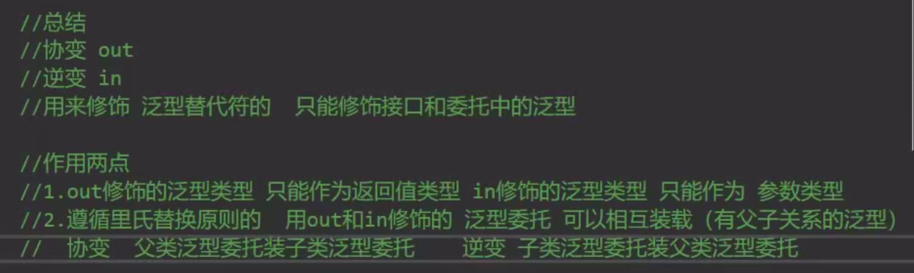

# 栈stack

## 1.本质：

是一个C#封装好的类       本质是一个object[]数组  只是封装了特殊的存储规则           先进后出FILO

## 2.方法：

Clear

pop

push  

peek   查看栈顶元素

Contains       包含

# 队列queue

## 1.本质：

本质也是一个object[]数组  只是封装了特殊的规则  FIFO

## 2.方法：

Enqueue     入队

Dequeue   出队

Peek    查  对头元素

Contains  包含


default  ----类型的默认值


# 哈希表

## 1.哈希表(又称散列表)

​    是基于键的哈希代码组织起来的   键/键对
    作用是提高数据查询的效率
    使用键来访问集合中的元素

## 2.增删查改和遍历

```c#
#region 增删查改
            //增   不要出现相同的键
            ht.Add(1, 13);
            
		   //删
            //1.只能通过键删除
            ht.Remove(1);
            //2.删除不存在的元素  没反应
            ht.Remove(100);
            //3.直接清空
            ht.Clear();

            //查   
            //1.通过键去查   查不到返回空
            Console.WriteLine(ht[1]);
            Console.WriteLine(ht["age"]);
            //2.查看是否存在	----键和值都可以查存在
                //根据键检测 
                ht.ContainsKey(1);
            //根据值检测
            ht.ContainsValue("张三");

            //改 
            //只能改键对应的值 无法修改键
            ht[1] = true;
            #endregion

            #region 遍历
            //1.Hashtable.Count 得到键值对数目
            
            //遍历所有键
            foreach (object item in ht.Keys)
            {
                Console.WriteLine("键"+item);
                Console.WriteLine("值：" + ht[item]);
            }

            //遍历所有值
            foreach (object item in ht.Values)
            {
                Console.WriteLine("值" + item);  //无法通过值获取键
            }

            //遍历所有键值对
            foreach (DictionaryEntry item in ht)
            {
                Console.WriteLine("键值对" + item);
            }

            //迭代器遍历
            IDictionaryEnumerator myEnumerator =  ht.GetEnumerator();
            bool flag = myEnumerator.MoveNext();
            while(flag)
            {
                Console.WriteLine("键 "+myEnumerator.Key+"值 " + myEnumerator.Value);
                flag  = myEnumerator.MoveNext();
            }
            #endregion
```


# 泛型

## 1.泛型是什么

泛型实现了类型参数化，达到代码重用目的
通过类型参数化来实现同一份代码上操作多种类型

泛型相当于类型占位符
定义类或方法时使用替代符代表变量类型
当真正使用类或者方法时再具体指定类型


## 2.泛型方法

使用泛型类的泛型类型不是泛型方法 类型在声明类的时候就确定了
可以再写一个其他占位符的函数进行重载


# 泛型约束

## 1.什么是泛型约束

让泛型的类型有一定的限制
关键字:where
泛型约束一共有6种
1.值类型                               where 泛型字母:struct
2.引用类型                             where 泛型字母 : class
3.存在无参公共构造函数                  where 泛型字母:new () 
4.某个类本身或者其派生类                where  泛型字母:类名
5.某个接口的派生类型                    where 泛型字母:接口名
6.另一个泛型类型本身或者派生类型         where 泛型字母:另一个泛型字母

## 2.各种泛型约束

### 1.值类型

传入类型是值类型                       

### 2.引用类型

传入类型是引用类型

### 3.存在无参公共构造函数

传入的类型存在无参公共构造函数

注意:结构体有无参数构造函数(默认生成)   进行构造函数重载时也不会替换原有的无参构造函数  结构体中的无参数构造函数必须为public  所以满足了所有条件 
抽象类  即使有无参数公共构造函数也能不能使用 不能new

### 4.某个类本身或者其派生类

传入的类型是泛型约束限制的类或者该类的派生类           

### 5.某个接口的派生类型

传入的类型是限制的接口，实现该接口的类，继承该接口的接口，实现接口派生接口的类

### 6.另一个泛型类型本身或者派生类型

 

```c#
 class Test6<T,U> where T : U  //T是U本身  T是U的派生类 T实现了U的接口
    {
        public T a;
        public void testFunc<K,V>(K a) where K : V
        {
            Console.WriteLine(a);
        }
    }
```


# List

```c#
List<T> a = new List<T>();

//范围批量加
List<string> list = new List<string>();
List<string> list1 = new List<string>();
list.Add("adasdas");
list1.Add("b");
list1.AddRange(list);
```

# 字典

字典查找值时候找不到会报错    哈希表不会(返回一个null)

# 链表LinkList

## 1.LinkedList

LinkedList是一个C#为我们封装好的类
它的本质是一个可变类型的泛型双向链表

链表节点类LinkedListNode     -----可以通过获取节点然后修改值

# 委托

## 知识点一 委托是什么

委托是 函数(方法)的容器
可以理解为表示函数(方法)的变量类型
用来 存储、传递函数(方法)
委托的本质是一个类，用来定义函数(方法)的类型(返回值和参数的类型)
不同的 函数(方法)必须对应和各自"格式"一致的委托

委托不存在重载 不能重名

## 2.委托可以存储多个函数    -----多播传播

+=     ---- 添加函数               -=   ----去除函数    多减不报错   找不到就不操作

## 3.系统定义的委托

Action  无参数无返回值
Func<T>  可以指定返回类型的泛型委托
Action <T1,T2,...,T16>   可以传n个参数的泛型委托   1-16个参数的委托  

Func<T1,T2,T3..T16>  传n个参数,一个返回值，0-15个输入参数

## 4.补充知识点

当用有返回值的委托容器存储多个函数时 

```c#
MyFun1 myFun2 = null;
            myFun2 += () => { Console.WriteLine("第一次"); return 1; };
            myFun2 += () => { Console.WriteLine("第二次"); return 2; };
            myFun2 += () => { Console.WriteLine("第三次"); return 3; };
            //如果直接调用 虽然3个函数的逻辑会执行
            //但是返回值只能获取到最后一个的
            Console.WriteLine(myFun2());

            Console.WriteLine("------------------------------------");
            //通过GetInvocationList方法获取到委托列表
            //然后迭代器遍历获取到每一个函数单独执行单独获取
            foreach (MyFun1 item in myFun2.GetInvocationList())
            {
                Console.WriteLine(item());
            }
```


# 事件

## 1.事件是什么

事件是基于委托的存在
事件是委托的安全包裹
让委托的使用更具有安全性
事件 是一种特殊的变量类型

## 2.事件相对于委托的区别:

1.不能在类外部 赋值
2.不能再类外部 调用
注意:
它只能作为成员存在于类和接口以及结构体中

## 3.为什么使用事件

1.防止外部随意置空委托
2.防止外部随意调用委托
3.事件相当于对委托进行了一次封装 让其更加安全

## 4.使用

```c#
 static void Main(string[] args)
        {
           Test test = new Test();
            test.myFunc = null;
            //test.myEvent = null;  赋值会报错 不能外部赋值
            
            test.myEvent += TestFunc;  //可以使用+= -=去添加或者移除记录的函数

            test.myFunc();
            //test.myEvent(); 不能再外部调用  可以在类的内部封装调用  
        }
static void TestFunc()
        {
            Console.WriteLine("TestFunc");
        }
```

# 匿名函数

## 1.语法

```c#
 delegate() 
        {
            Console.WriteLine("匿名函数");
        };
```

## 2.匿名函数的缺点

添加到委托或事件容器中后 不记录 无法单独移除只能清空       ----多播委托

# Lambad表达式

## 1.什么是lambad表达式

可以将lambad表达式 理解为匿名函数的简写
它除了写法不同外
使用上和匿名函数一模一样
都是和委托或者事件 配合使用的

## 2.lambad表达式的语法

```c#
（参数列表）=>
            {
                函数体
            };
```

# 闭包

## 1.什么是闭包

内层的函数可以引用包含在它外层的函数的变量
即使外层函数的执行已经终止
注意:
该变量提供的值并非变量创建时的值，而是在父函数范围内的最终值,

## 2.案例

```c#
public class test
    {
        public event Action action;
        
        public test()
        {
            int a = 0;
            //这里就形成了闭包
            //因为 当构造函数执行完毕时 其中申明的临时变量value的声明周期被改变了
            action = () =>
            {
                Console.WriteLine(a);
            };

            for(int i = 0; i < 10; i++)
            {
                //int index = i;  新变量使输出是每次的值  不然输出全是最终值
                 action+= () =>
                {
                    //Console.WriteLine(i);   
                    Console.WriteLine(i);    //一直是10（父函数的最终值,此处为i不满足条件的i值，即i = 10） 若要i是1-9需要，每次都使用新变量来传递   
                };
            }
        }
    }
```

# List排序

## 1.自定义类的排序

### (1)在类中实现IComparable<T>接口, 实现CompareTo方法

```c#
class Item : IComparable<Item>
    {
        public int money;

        public Item(int money)
        {
            this.money = money;
        }

        public int CompareTo(Item? other)
        {
            //小于0 放在传入对象的前面
            //等于0 保持当前位置不变
            //大于0 放在传入对象的后面

            //可以简单理解 传入对象的位置 就是θ
            //如果你的返回为负数 就放在它的左边 也就前面
            //如果你返回正数 就放在它的右边 也就是后面

            if(this.money < other.money)
                return -1;
            else if(this.money > other.money)
                return 1;
            else
                return 0;
        }
```

### (2) 通过传入函数(委托)

```c#
list.Sort((a, b) => { return b.id - a.id; });     //也可以传入一个函数
```


# 协变逆变

## 1.什么是协变逆变

### 协变:

和谐的变化，自然的变化
因为 里氏替换原则 父类可以装子类
所以 子类变父类
比如 string 变成 object
感受是和谐的

### 逆变:

逆常规的变化，不正常的变化
因为 里氏替换原则 父类可以装子类 但是子类不能装父类
所以 父类变子类
比如 object 变成 string
感受是不和谐的

### 协变和逆变是用来修饰泛型的

协变:out
逆变:in
用于在泛型中 修饰 泛型字母的
只有泛型接口和泛型委托能使用

## 2.作用和案例

```c#
//1.返回值 和 参数
//用 out修饰的泛型  只能作为返回值
delegate T TestOut <out T>();
//用 in修饰的泛型  只能作为参数
delegate void TestIn <in T>(T t);
class Father
{ }
class Son : Father
{ }
    internal class Program
    {
        static void Main(string[] args)
        {
            #region 知识点二 作用 （结合里氏替换原则理解）
            //协变  父类总是能被子类替换
            TestOut<Son> os = () =>{ return new Son(); };
            TestOut<Father> of = os;
            Father f = of();  //实际上  返回的 是os里装的函数  返回的是 Son
            
            //逆变  父类总是能被子类替换
            TestIn<Father> iF = (value) => { };   //iF是  TestIn<Father>类型的
            TestIn<Son> iS = iF;      //iS是TestIn<Son>  却装载了iF   子类装父类
            iS(new Son());  //实际上 调用的是 iF
            #endregion
        }
    }
```

## 3.不变性（Invariance）

如果没有使用`in`或`out`关键字，则该泛型类型就是不变的（Invariant）。对于不变的泛型类型，只能使用确切定义时使用的类型，不能进行协变或逆变。

例如，`List<T>`是一个不变的类型，因此你不能将`List<string>`赋值给`List<object>`变量，反之亦然。

这些特性使得C#中的泛型更加灵活和强大，但同时也需要开发者小心处理以避免潜在的类型安全问题。理解协变、逆变以及何时应用它们对于编写高效且安全的代码至关重要。



# 多线程

## 1.基础知识

### (1)进程

是系统进行资源分配和调度的基本单位，是操作系统结构的基础
说人话:打开一个应用程序就是在操作系统上开启了一个进程
进程之间可以相互独立运行，互不干扰
进程之间也可以相互访问、操作

### (2)线程

系统能够进行运算调度的最小单位
它被包含在进程之中，是进程中的实际运作单位
一条线程指的是进程中一个单一顺序的控制流，一个进程中可以并发多个线程
我们目前写的程序 都在主线程中
简单理解线程:
就是代码从上到下运行的一条“管道”

### (3)多线程

我们可以通过代码 开启新的线程
可以同时运行代码的多条“管道”就叫多线程

## 2.语法

```c#
 //线程类 Thread 
//1.申明一个新的线程
// 注意 线程执行的代码需要封装到一个函数中
//新线程 将要执行的代码封装到一个函数中    
Thread t = new Thread(new ThreadStart(test));   

//2.开启线程
t.Start();

//3.设置为后台线程
//当前台线程都结束了的时候,整个程序也就结束了,即使还有后台线程正在运行
//后台线程不会防止应用程序的进程被终止掉
//如果不设置为后台线程 可能导致进程无法正常关闭
//t.IsBackground = true;  //如果设置为后台线程,则当前进程结束后,后台线程也会结束

//4.关闭释放一个线程
//如果开启的线程中不是死循环 是能够结束的逻辑 那么 不用刻意的去关闭它
//如果是死循环 想要中止这个线程 有两种方式
//4.1   死循环改为使用 bool标识
//4.2通过线程提供的方法(注意在.net core版本中无法中止 会报错)
//终止线程
//t.Abort();

//5.线程休眠
//让线程休眠多少毫秒
//在哪个线程里执行  就休眠哪个线程
// Thread.Sleep(1000);

```

## 3.线程间共享数据

多个线程使用的内存是共享的，都属于该应用程序(进程)
所以要注意 当多线程 同时操作同一片内存区域时可能会出问题
可以通过加锁的形式避免问题   lock

lock
当我们在多个线程当中想要访问同样的东西 进行逻辑处理时
为了避免不必要的逻辑顺序执行的查错
lock(引用类型对象)

## 4.多线程的意义

可以用多线程专门处理一些复杂耗时的逻辑
比如 寻路、网络通信等等

# 预处理器指令

## 1.常见的预处理器指令

### 1.#define和#undef

#define
定义一个符号，类似一个没有值的变量
#undef
取消define定义的符号，让其失效
两者都是写在脚本文件最前面
一般配合 if指令使用 或配合特性

### 2.条件分支

#if
#else if
#else
#endif
和if语句规则一样
一般配合#define定义的符号使用
用于告诉编译器进行编译代码的流程控制

```c#
#if unity &&CSharp //如果发现unity这个符号定义了   那么就执行下面的代码
            Console.WriteLine("unity & C#");
#endif
```

### 3.警告和错误

#warning
#error
告诉编译器
是报警告还是报错误
一般还是配合if使用

# 反射

## 1.概念

### (1).什么是程序集

程序集是经由编译器编译得到的，供进一步编译执行的那个中间产物
在WINDOWS系统中，它一般表现为后缀为·dll(库文件)或者是·exe(可执行文件)的格式
说人话:
程序集就是我们写的一个代码集合，我们现在写的所有代码
最终都会被编译器翻译为一个程序集供别人使用
比如一个代码库文件(d11)或者一个可执行文件(exe)

### (2).元数据

元数据就是用来描述数据的数据
这个概念不仅仅用于程序上，在别的领域也有元数据
说人话:
程序中的类，类中的函数、变量等等信息就是 程序的 元数据
有关程序以及类型的数据被称为 元数据，它们保存在程序集中

### (3).反射的概念

程序正在运行时，可以查看其它程序集或者自身的元数据。
一个运行的程序查看本身或者其它程序的元数据的行为就叫做反射
说人话:
在程序运行时，通过反射可以得到其它程序集或者自己程序集代码的各种信息
类，函数，变量，对象等等，实例化它们，执行它们，操作它们

## 2.Type

### 1.Type(类的信息类)

它是反射功能的基础!
它是访问元数据的主要方式
使用 Type 的成员获取有关类型声明的信息
有关类型的成员(如构造函数、方法、字段、属性和类的事件)

### 2.方法

#### 1.获取Type    ---结构体和类的Type

```c#
//1.万物之父object中的GetType方法可以获取对象的Type
int  a = 0;
Type type = a.GetType();
Console.WriteLine(type);
            
//2.通过typeof关键字  传入类名 也可以得到对象的Type
Type type1 = typeof(int);
Console.WriteLine(type1);
            
//3.通过类的名字 也可以获取类型 
//注音  类名必须包含命名空间 不然找不到
Type type2 = Type.GetType("System.Int32");
Console.WriteLine(type2);
```

#### 2.得到类的程序集信息

```c#
//可以通过Type得到类型所在的程序集信息
Console.WriteLine(type.Assembly);
Console.WriteLine(type1.Assembly);
Console.WriteLine(type2.Assembly);
```

#### 3.获取类中的所有公共成员

```c#
//首先得到 Type
Type t = typeof(test);
//然后得到所有的公共成员
MemberInfo[] infos = t.GetMembers();
for(int i = 0; i < infos.Length; i++)
{
		Console.WriteLine(infos[i]);
}
```

#### 4.获取类的公共构造函数并调用

```c#
//1.获取所有的构造函数
ConstructorInfo[] cis = t.GetConstructors();
for(int i = 0; i < cis.Length; i++)
{
	Console.WriteLine(cis[i]);
}

//2.获取其中一个构造函数并执行
//得构造函数传入 Type数组 数组中内容按顺序是参数类型
//执行构造函数传入object数组 表示按顺传入的参数

//  2-1得到无参构造
ConstructorInfo info = t.GetConstructor(new Type[0]);
//执行无参构造  无参构造 没有参数 传null
test obj = info.Invoke(null) as test;
Console.WriteLine(obj.j);

// 2-2得到有参构造
ConstructorInfo info2 = t.GetConstructor(new Type[]{typeof(int), typeof(int), typeof(string)});   // i  j str
obj = info2.Invoke(new object[]{1, 2, "hello"}) as test;   // i j str---test中的i j str 
Console.WriteLine(obj.j+" "+obj.str);
```

#### 5.获取类的公共成员变量

```c#
Console.WriteLine();
//1.得到所有的公共成员变量
FieldInfo[] fieldInfos= t.GetFields();
for(int i = 0; i < fieldInfos.Length; i++)
{
	Console.WriteLine(fieldInfos[i]);
}
 
//2.得到指定名称的公共成员变量
FieldInfo infoj = t.GetField("j");
Console.WriteLine(infoj);
            
//3.通过反射获取和设置对象的值
test t1 = new test ();
t1.j = 1;
t1.str = "hello";
//3-1通过反射 获取指定对象的某个变量的值
Console.WriteLine(infoj.GetValue(t1));
//3-2通过反射 设置指定对象的某个变量的值
infoj.SetValue(t1, 2);
Console.WriteLine(infoj.GetValue(t1));
```

#### 6.获取类的公共成员方法

```c#
//通过Type类中的 GetMethod方法 得到类中的方法
            //MethodInfo 是方法的反射信息
            Type strType = typeof(string);
            //1.如果存在方法重载 用Type数组表示参数类型
            MethodInfo[] methodInfos = strType.GetMethods();
            MethodInfo subStr = strType.GetMethod("Substring",new Type[] {typeof(int), typeof(int) });
            string tstring = "adadasdasd";
            object tmp =  subStr.Invoke(tstring, new object[] { 1, 2 });   //tstring执行   返回用超级父类object接收，使用string报错没确定是什么
            Console.WriteLine(tmp);
```

## 3.Assembly

### 1.Assembly

程序集类
主要用来加载其它程序集，加载后
才能用Type来使用其它程序集中的信息
如果想要使用不是自己程序集中的内容 需要先加载程序集
比如 d11文件(库文件)
简单的把库文件看成一种代码仓库，它提供给使用者一些可以直接拿来用的变量、函数或类

### 2.三种加载程序集的函数

#### 1.一般用来加载在同一文件下的其它程序集

```c#
      Assembly asembly2 = Assembly.Load("程序集名称");
```

#### 2.一般用来加载不在同一文件下的其它程序集

```c#
Assembly asembly = Assembly.LoadFrom("包含程序集清单的文件的名称或路径”);
```

#### 3.加载其他文件的程序集

```c#
Assembly asembly3 = Assembly.LoadFile("要加载的文件的完全限定路径");
```

### 3具体使用

```c#
 //1.先加载一个指定的程序集
Assembly asembly = Assembly.LoadFrom("F:\\unity\\TangCourse\\C#\\进阶\\CSharp进阶\\反射加载的数据\\bin\\Debug\\net7.0\\反射加载的数据.dll");
Type[] types = asembly.GetTypes();
for (int i = 0; i < types.Length; i++)
{
	Console.WriteLine(types[i]);
}

//2.再加载程序集中的一个类对象  之后才能使用反射
Type typea = asembly.GetType("反射加载的数据.a");
MemberInfo[] members = typea.GetMembers();
for (int i = 0; i < members.Length; i++)
{
	Console.WriteLine(members[i]);
}

//3.通过反射 实例化一个typea对象
//首先得到枚举Type 来得到可以传入的参数
Type E_aa = asembly.GetType("反射加载的数据.aa");
FieldInfo aa_a = E_aa.GetField("a");
            
//直接实例化对象
object obja =  Activator.CreateInstance(typea,aa_a.GetValue(null),1);
//FieldInfo对象包含关于字段的信息（如字段名称、类型等），但它不是字段的实际值。要获取字段的值，您需要调用GetValue方法，
//并传入适当的对象实例（对于静态字段，传递null作为参数）。   传一个null就可以得到枚举的值

//得到对象中的方法 通过反射
MethodInfo show = typea.GetMethod("show");
show.Invoke(obja,new object[] {aa_a.GetValue(null)});       // 执行obj对象的方法   枚举对象 放在object数组内
            
```

## 4.Activator

### 1.Activator

用于快速实例化对象的类
用于将Type对象快捷实例化为对象
先得到Type
然后 快速实例化一个对象

### 2.使用

```c#
 Type testType = typeof(test);
//1.无参构造
test testObj = Activator.CreateInstance(testType) as test;
Console.WriteLine(testObj.str);
//2.有参构造
testObj = Activator.CreateInstance(testType,  1, 2, "world" ) as test;
Console.WriteLine(testObj.str);
```

# 特性

## 1.特性是什么

特性是一种允许我们向程序的程序集添加元数据的语言结构
它是用于保存程序结构信息的某种特殊类型的类

特性与程序实体关联后，即可在运行时使用反射查询特性信息


通俗讲：

特性本质是个类
我们可以利用特性类为元数据添加额外信息
比如一个类、成员变量、成员方法等等为他们添加更多的额外信息
之后可以通过反射来获取这些额外信息

## 2.自定义特性

继承特性基类Attribute
[AttributeUsage(AttributeTargets.Class | AttributeTargets.Struct, AllowMultiple = true, Inherited = true)]

```c#
//通过为特定类 加特性 限制其使用范围
    [AttributeUsage(AttributeTargets.Class| AttributeTargets.Struct,AllowMultiple = true,Inherited =true)]
    //参数-AttributeTargets   -特性能够用在哪些地方
    //参数二:AllowMultiple     -是否允许多个特性实例用在同一个目标上
    //参数三:Inherited         -特性是否能被派生类和重写成员继承,
    public class MyCustom2Attribute : Attribute
    {

    }
```

## 3.特性的使用

```c#
Myclass mc = new Myclass();
            Type t = mc.GetType();
            //mc.OldFunc();
            mc.SpeakCaller("hello");
           
            //判断是否使用了某个特性
            if (t.IsDefined(typeof(MyCustomAttribute), false)) //参数一： 特性的类型  参数二: 代表是否搜索继承链(属性和事件忽略此参数)
            {
                Console.WriteLine("该类使用了MyCustomAttribute特性");

                //获取Type元数据中的所有特性
                object[] array = t.GetCustomAttributes(true);
                for(int i = 0; i < array.Length; i++)
                {
                    if (array[i] is MyCustomAttribute)
                    {
                        Console.WriteLine((array[i] as MyCustomAttribute).info);
                        (array[i] as MyCustomAttribute).test();
                    }
                }
                //获取特性
                /*MyCustomAttribute attr = (MyCustomAttribute)t.GetCustomAttributes(typeof(MyCustomAttribute), false)[0];
                Console.WriteLine(attr.info);*/
            }
```

4.系统自带特性

# 迭代器

## 1.迭代器是什么

迭代器(iterator)有时又称光标(cursor)
是程序设计的软件设计模式
迭代器模式提供一个方法顺序访问一个聚合对象中的各个元素
而又不暴露其内部的标识

在表现效果上看
是可以在容器对象(例如链表或数组)上遍历访问的接口
设计人员无需关心容器对象的内存分配的实现细节
可以用foreach遍历的类，都是实现了迭代器的

## 2.标准迭代器的实现方法

关键接口:IEnumerator,IEnumerable
命名空间:using system.collections;
可以通过同时继承IEnumerable和IEnumerator实现其中的方法

## 3.用yield return 语法糖实现迭代器

yield return 是c#提供给我们的语法糖
所谓语法糖，也称糖衣语法
主要作用就是将复杂逻辑简单化，可以增加程序的可读性
从而减少程序代码出错的机会

关键接口:IEnumerable
命名空间:using system.collections;
让想要通过foreach遍历的自定义类实现接口中的方法GetEnumerator即可

## 4.迭代器实现

```c#
 //1.不使用yield return语法糖
 class CustomList :IEnumerable,IEnumerator
    {
        private int[] list;
        private int position = -1;  //从-1开始的光标 用于表示 数据得到了哪个位置
        public CustomList()
        {
            list = new int[] {1,2,3,4,5,6,7,8,9 };
        }

        public IEnumerator GetEnumerator()
        {
            Reset();    //调用该方法时先复原指针 否知position保留之前位置信息
            return this;
        }
 
        public object Current
        {
            get { return list[position];  }
        
        }
        public bool MoveNext()
        {
            ++position;
            //是否溢出
            return position < list.Length;
        }

        public void Reset()  //将光标复原  一般写在GetEnumerator中
        {
            position = -1;
        }
    }
    
//使用yield return 语法糖
class CustomList<T> : IEnumerable
    {
        private T[] array;
        public CustomList(params T[] array)
        {
            this.array = array;
        }
        public IEnumerator GetEnumerator()
        { 
            for (int i = 0; i < array.Length; i++)
            {
            	//yield return 关键字 配合迭代器使用
                //可以理解为 暂时返回 保留当前的状态
                //一会还会再回来
                //C#语法糖
                yield return array[i];
            }
        }
    }
        
```

## 5.foreach的本质

1.先获取in后面这个对象的IEnumerator    -----会调用对象其中的GetEnumerator方法 来获取  只要有GetEnumerator方法就行，接口不实现也不报错
2.执行得到的IEnumerator中的MoveNext方法
3.如果MoveNext方法返回true,则执行Current方法 获取当前位置的值  然后赋值给 item
4.如果MoveNext方法返回false,则结束循环

## 6.总结:

迭代器就是可以让我们在外部直接通过foreach遍历对象中元素而不需要了解其结构
主要的两种方式
1.传统方式 继承两个接口 实现里面的方法
2.用语法糖 yield return 去返回内容 只需要继承一个接口即可